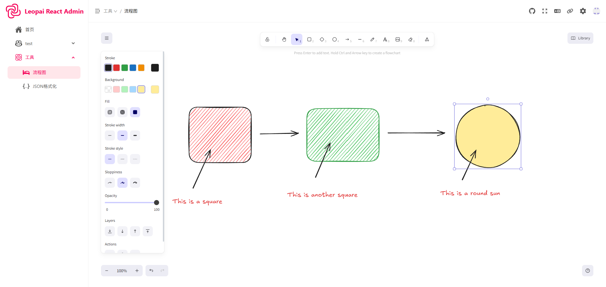
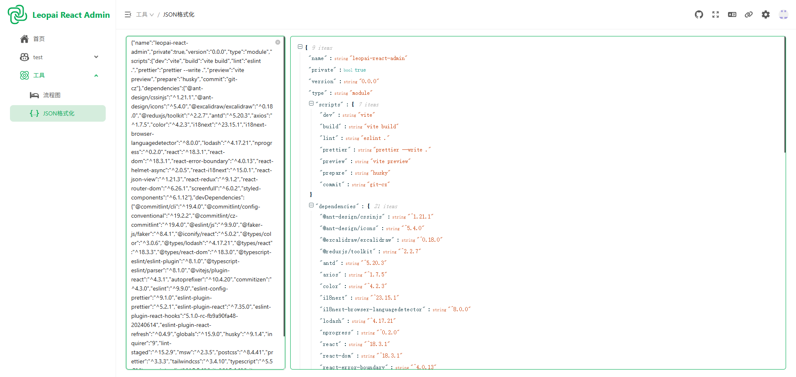

### Leopai React Admin

一个基于 React + TypeScript + Vite 构建的现代化后台管理系统模板，已完成核心架构搭建，支持快速扩展功能模块；采用模 块化设计，集成状态管理、路由控制、数据模拟等核心功能。

### 技术栈

- ⚡️ [React 18](https://reactjs.org/) - 用于构建用户界面的 JavaScript 库
- 🎯 [TypeScript](https://www.typescriptlang.org/) - JavaScript 的超集，添加了类型系统
- 🚀 [Vite](https://vitejs.dev/) - 下一代前端构建工具
- 🎨 [Ant Design](https://ant.design/) - 企业级 UI 设计语言和 React 组件库
- 🎭 [Tailwind CSS](https://tailwindcss.com/) - 实用优先的 CSS 框架
- 🌐 [React Router](https://reactrouter.com/) - React 的路由库
- 🔄 [Redux Toolkit](https://redux-toolkit.js.org/) - Redux 官方推荐的工具集
- 🌍 [i18next](https://www.i18next.com/) - 国际化解决方案
- 🎨 [Styled Components](https://styled-components.com/) - CSS-in-JS 解决方案

### 项目预览






### 特性

- 📱 响应式布局
- 🌙 深色模式支持
- 🌍 国际化支持
- 🎨 可配置的主题
- 📦 组件按需加载

### 快速开始

```bash
# 克隆项目
https://github.com/onlypai/leopai-react-admin.git

# 进入项目目录
cd leopai-react-admin

# 安装依赖
pnpm install

# 启动开发服务器
pnpm dev

# 构建生产版本
pnpm build

# 代码格式修整
pnpm prettier

# 提交代码
pnpm commit
```
### 测试账号
- 账号：admin
- 密码：admin123456

### 项目结构

```
src/
├── assets/        # 静态资源
├── components/    # 公共组件
├── hooks/         # 自定义 Hooks
├── layouts/       # 布局
├── router/        # 路由配置
├── store/         # Redux 状态管理
├── styles/        # 全局样式
├── utils/         # 工具函数
└── views/         # 页面组件
```

### 开发规范

- 遵循 ESLint 规则
- 使用 Prettier 进行代码格式化
- 遵循 TypeScript 类型检查
- 使用 Conventional Commits 规范
